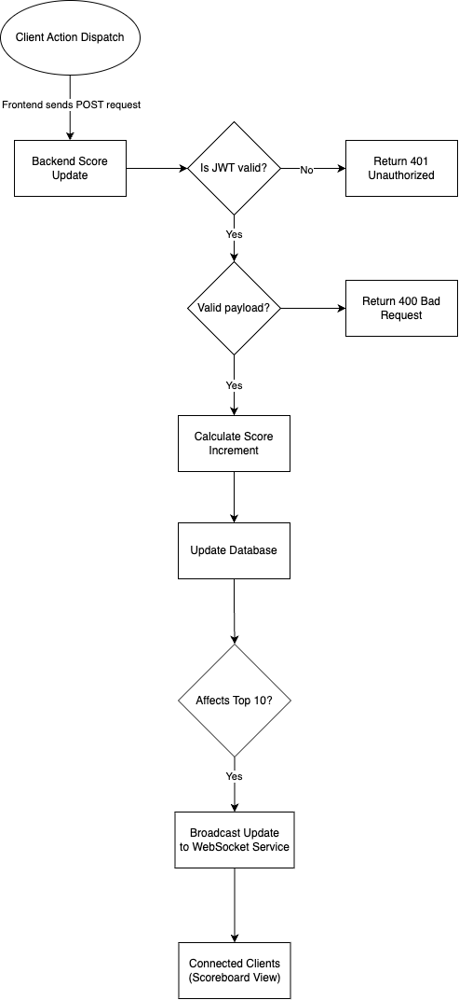

# Scoreboard API Service

This repository contains the specifications and design for a Scoreboard API Service that provides live updates for a top 10 user scoreboard. The service ensures secure score updates and real-time broadcasting of changes.

---

## Features

### Update Score API
- **Method:** `POST`
- **Authentication:** Token-based (JWT)
- **Request Payload:**
  ```json
  {
    "user_id": "<string>",
    "action_id": "<string>"
  }
  ```
- **Response:**
  ```json
  {
    "success": true,
    "new_score": "<integer>"
  }
  ```
- **Error Codes:**
	- `401 Unauthorized`: Invalid or missing authentication token.
	- `400 Bad Request`: Invalid payload structure.
	- `403 Forbidden`: Suspicious activity detected.

### Real-Time Scoreboard
- **WebSocket Endpoint:** `/ws/scoreboard`
- Pushes live updates to connected clients when the top 10 scores change.

---

## Database Schema

### Table: `scores`
| Field       | Type      | Description                       |
|-------------|-----------|-----------------------------------|
| `user_id`   | `VARCHAR` | Unique identifier for the user    |
| `score`     | `INTEGER` | Current score of the user         |
| `updated_at`| `TIMESTAMP` | Last update timestamp          |

### Table: `actions`
| Field       | Type      | Description                         |
|-------------|-----------|-------------------------------------|
| `action_id` | `VARCHAR` | Unique identifier for an action      |
| `points`    | `INTEGER` | Points associated with the action    |

---

## Flow of Execution

1. **Client Action Dispatch:**
	- User performs an action on the frontend.
	- Frontend sends a `POST` request.

2. **Backend Score Update:**
	- Validate authentication and payload.
	- Calculate score increment based on `action_id`.
	- Update the user’s score in the database.

3. **Real-Time Scoreboard Update:**
	- If the updated score affects the top 10 scores:
		- Push the new scoreboard data to all connected WebSocket clients.

---

## Diagram

The flow diagram for the system can be found in the `flowdiagram.drawio.png` file included in this repository. It illustrates the flow of data between components.



---

## Additional Notes

### Improvements and Recommendations
1. **Rate Limiting:**
	- Implement rate limiting on the endpoint to prevent abuse (e.g., 10 requests per minute per user).

2. **Monitoring and Alerts:**
	- Integrate logging and monitoring tools (e.g., Prometheus, Grafana) to detect anomalies like sudden score spikes.

3. **Data Integrity:**
	- Periodically audit scores for irregularities (e.g., unrealistic increments).

4. **Caching:**
	- Use caching (e.g., Redis) for frequently accessed data like the top 10 scores to reduce database load.

5. **Action Validation:**
	- Use a cryptographic signature on `action_id` from the client to prevent tampering.

6. **Scalability:**
	- For real-time updates, consider message queues (e.g., Kafka) to handle large-scale concurrent WebSocket connections.
